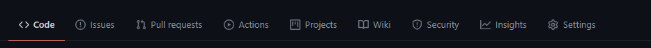
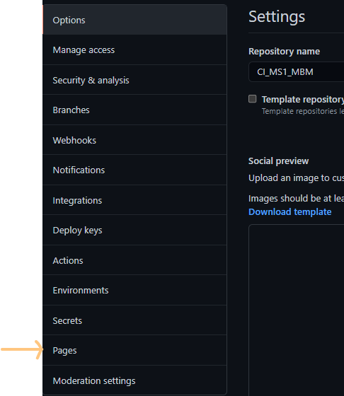
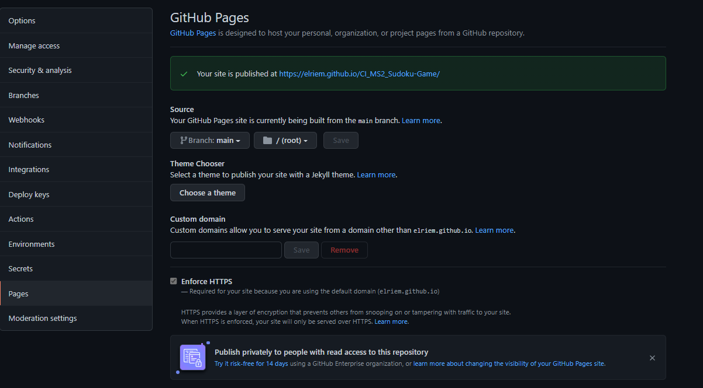
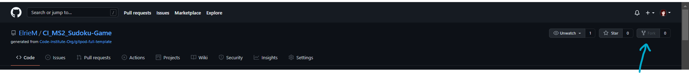

<h1 align="center">Sudoku Showdown</h1>

[View the live project here.](https://elriem.github.io/CI_MS2_Sudoku-Game/)

# Contents <!-- omit in toc -->

- [1. User Experience (UX)](#1-user-experience-ux)
  - [1.1 Target audience](#11-target-audience)
  - [1.2 User Stories](#12-user-stories)
    - [First Time Visitor Goals](#first-time-visitor-goals)
    - [Returning Visitor Goals](#returning-visitor-goals)
    - [Frequent User Goals](#frequent-user-goals)
    - [Site Owner Goals](#site-owner-goals)
  - [1.3 Design](#13-design)
    - [Colour Scheme](#colour-scheme)
    - [Typography](#typography)
    - [Imagery](#imagery)
  - [1.4 Structure](#14-structure)
  - [1.5 Wireframes](#15-wireframes)
- [2. Features](#2-features)
  - [2.1 Existing Features](#21-existing-features)
  - [2.2 Features Left to Implement](#22-features-left-to-implement)
- [3 Technologies Used](#3-technologies-used)
  - [3.1 Language Used](#31-language-used)
  - [3.2 Frameworks, Libraries & Programs Used](#32-frameworks-libraries--programs-used)
- [4. Testing](#4-testing)
  - [4.1 Validator tools](#41-validator-tools)
  - [4.2 Testing User Stories from User Experience (UX) Section](#42-testing-user-stories-from-user-experience-ux-section)
    - [First Time Visitor Goals](#first-time-visitor-goals-1)
    - [Returning Visitor Goals](#returning-visitor-goals-1)
    - [Frequent User Goals](#frequent-user-goals-1)
    - [Site Owner Goals](#site-owner-goals-1)
      - [14. As the Site Owner, I want to inform students (existing and prospective) of upcoming events](#14-as-the-site-owner-i-want-to-inform-students-existing-and-prospective-of-upcoming-events)
  - [4.3. Further Testing](#43-further-testing)
  - [4.4 Testing Bugs - Resolved](#44-testing-bugs---resolved)
  - [4.5 Known Bugs](#45-known-bugs)
- [5. Deployment](#5-deployment)
  - [5.1. GitHub Pages](#51-github-pages)
  - [5.2. Forking the GitHub Repository](#52-forking-the-github-repository)
  - [5.3. Making a Local Clone](#53-making-a-local-clone)
- [6. Credits](#6-credits)
  - [6.1. Code](#61-code)
  - [6.2. Content](#62-content)
  - [6.3. Media](#63-media)
  - [6.4. Acknowledgements](#64-acknowledgements)

# 1. User Experience (UX)

This website was created for Sudoku enthusiasts, offering an opportunity to improve your time to completion and compete for the best completion time against other site visitors.

## 1.1 Target audience

- New Sudoku players interested looking for a new hobby.
- Prospective players hoping to gain the potential health benefits of playing Sudoku (improved thinking skills, concentration, memory etc.)
- Seasoned players in improving their puzzle completion times.
- Players with a competitive streak hoping to guage how they stack up against other players.

## 1.2 User Stories

### First Time Visitor Goals

  1. As a First Time Visitor, I want to easily navigate from the landing page to the sections that interest me.
  2. As a First Time Visitor, I want to have access to and learn the rules of the game.
  3. As a First Time Visitor, I want to practice to improve my completion times.
  4. As a First Time Visitor, I want to see a log of my completion times while I am playing a practice game to monitor improvement.
  5. As a First TIme Visitor, I want to view hints and tips on how best to approach the game.
  6. As a First Time Visitor, I want to be able to have unlimited access to new puzzles.
  7. As a First Time Visitor, I want to be able to change the background to my preference (dark / light / colourful).
  8. As a First Time Visitor, I want to have the option of being alerted when I've made an error in completing the puzzle.
  
### Returning Visitor Goals
  
  9. As a Returning Visitor, I want to easily navigate from the landing page to the game (challenge / practice).
  10. As a Returning Visitor, I want to view hints and tips to improve my game completion times.
  11. As a Returning Visitor, I want to have unlimited access to new puzzles.
  12. As a Returning Visitor, I want to have the option of being alerted when I've made an error in completing the puzzle.
  13. As a Returning Visitor, I want to be able to change the background to my preference (dark / light / colourful).

### Frequent User Goals
  
  14. As a Frequent User, I want to easily navigate from the landing page to the game (challenge / practice).
  15. As a Frequent User, I want to have unlimited access to new puzzles.
  16. As a Frequent User, I want to be able to change the background to my preference (dark / light / colourful).
  17. As a Frequent User, I want to be compare my skills to other players in a daily challenge.
  18. As a Frequent User, I want to practice to improve my completion times.

### Site Owner Goals

  12. As the Site Owner, I want users to attract and retain new users. 
  13. As the Site Owner, I want to receive users' suggestions for improvement or bug reports in a dedicated mailbox.

## 1.3 Design

### Colour Scheme

- For the colour scheme, I wanted a more "serious" colour due to the nature of the game. After reading an article by 99designs (11 website color schemes to help you find the perfect palette)[https://en.99designs.nl/blog/tips/website-color-schemes/], I performed a Google search for grey colour palettes.

- The main colours, selected from (grey website colour scheme search results)[https://www.google.com/search?q=grey+website+colour+scheme&rlz=1C1GEWG_nlNL954NL954&sxsrf=ALeKk01QQVHPWpUXTISKdEMnsKMCC5cSlQ:1625736050935&source=lnms&tbm=isch&sa=X&ved=2ahUKEwjttsHektPxAhXRC-wKHRKcBYIQ_AUoAXoECAEQAw&biw=1920&bih=937#imgrc=Rm5ReKnHhzM44M] and colormind (using #ccc to generate a palette)[http://colormind.io/bootstrap/] are:
  - Light Shades - #EEE (background for Light theme / text for Dark theme)
  - Light Accent - #8A6C8F (buttons on Dark theme)
  - Main brand colour - #CCC
  - Dark accent - #969ABF (buttons on Light theme)
  - Dark shades - #333 (background for Dark theme / text for Light theme)

- Snapshot of palette images can be viewed [here](docs\other\color-palette.png) and [here](docs\other\color-palette_(ccc).png).

### Typography

- When selecting a font for the puzzle, I searched Google Fonts (filtering for Numerals) for a font with . I selected EB Garamond, which is a classical font with numbers that are equal in size and align with all other numbers in a single line. This was important to me to make sure the numbers in the puzzle appeared in a straight line across the grid, with no numbers dipping below or sticking out above others.

- For the website text, I used EB Garamond's suggested pairing "Raleway" for its elegant and classic format, which I feel alings with the nature of the game.

### Imagery

- I opted for a simple background on the landing page because I wanted it to be more of an interactive "navigation tool".

- Since the majority of time is expected to be spent on the puzzle page, I selected background images for behind the page. The puzzle is quite plain, and adding the background is a nice way to passively engage the site user and leave them with a positive experience of the website. I opted for a more nature-focused theme, representing calm and beauty.

  - Background - Dark theme: [Close Up of Leaf](https://www.pexels.com/photo/close-up-of-leaf-326055/)
  - Background - Colourful theme: [Butterfly Perched on Flower](https://www.pexels.com/photo/butterfly-perched-on-flower-462118/)
  - Background - Light theme: [Pink and Purple Flower Field](https://www.pexels.com/photo/pink-and-purple-flower-field-262713/)

## 1.4 Structure

- 

## 1.5 Wireframes

- Home page - [view](docs\wireframes\home.png)
- Game page - [view](docs\wireframes\game.png)
- Rules page - [view](docs\wireframes\rules.png)

# 2. Features

## 2.1 Existing Features

- Responsive on all device sizes
- Interactive elements

## 2.2 Features Left to Implement

- Difficult levels

# 3 Technologies Used

## 3.1 Language Used

- [HTML 5](https://en.wikipedia.org/wiki/HTML5)
- [CSS](https://en.wikipedia.org/wiki/Cascading_Style_Sheets)
- [JavaScript](https://en.wikipedia.org/wiki/JavaScript)

## 3.2 Frameworks, Libraries & Programs Used

### - [Bootstrap 5:](https://getbootstrap.com/docs/5.0/getting-started/introduction/) <!-- omit in toc -->

- Bootstrap was used to assist with the responsiveness and styling of the website:
  - Horizontal alignment navs & tabs used for navbar
  
### - [Google Fonts:](https://fonts.google.com/) <!-- omit in toc -->

- Imported "EB Garamond" and "Raleway" fonts from Google Fonts into the style.css file used on all pages throughout the website.
  
### - [Font Awesome:](https://fontawesome.com/) <!-- omit in toc -->

- Font Awesome was used on all pages throughout the website to add icons for aesthetic and UX purposes.

### - [jQuery:](https://jquery.com/) <!-- omit in toc -->

- jQuery in conjunction with Bootstrap make the navbar, modal, accordion and carousel responsive.

### - [Git:](https://git-scm.com/) <!-- omit in toc -->

- Git was used for version control by utilizing the Gitpod terminal to commit to Git and Push to GitHub.

### - [GitHub:](https://github.com/) <!-- omit in toc -->

- GitHub is used to store the projects code after being pushed from Git.

### - [Visual Studio Code:](https://code.visualstudio.com/) <!-- omit in toc -->

- IDE used to write code for this project.

### - [Balsamiq:](https://balsamiq.com/) <!-- omit in toc -->

- Balsamiq was used to create the wireframes during the design process.

### - [Am I Responsive:](http://ami.responsivedesign.is/) <!-- omit in toc -->

- Used to create mockups for README file.

# 5. Deployment

## 5.1. GitHub Pages

The project was deployed to GitHub Pages as follows:

1. Log in to GitHub and locate the [GitHub Repository](#)
2. Locate the "Settings" button in the menu above the Repository.
   - Alternatively, click [here](https://docs.github.com/en/pages/getting-started-with-github-pages/creating-a-github-pages-site) from the "Creating your site" section for a description of the process. 
3. Scroll down the Settings page until you locate the "Pages" section.
4. In the "Source" section, select the dropdown "Branch:" dropdown and select "Main" and save. 
5. The page refreshes automatically.
6. Scroll to "Your site is published at..." for the puslished site link in the "GitHub Pages" section.

## 5.2. Forking the GitHub Repository

A fork is a copy of the repository, allowing you to experiment with changes without affecting the original project.

1. Log in to GitHub and locate the [GitHub Repository](#)
2. In the banner above the Repository, click on the "Fork" button.
3. 
4. If you have succeeded, you now have a copy of the original repository in your GitHub account.

Alternatively, click [here](https://docs.github.com/en/github/getting-started-with-github/quickstart/fork-a-repo) for a guide to fork a repository.

## 5.3. Making a Local Clone

A clone allows you to create a local copy of a repository on your computer and sync between your computer and the GitHub repository.

1. Log in to GitHub and locate the [GitHub Repository](#)
2. Click on Code, click on the copy button next to HTTPS to copy the URL. 
3. Open Git Bash.
4. Change the current working directory to the location where the cloned directory should be stored.
5. Type "git clone', then paste the URL copied in step 2.
6. Press Enter to create a local clone.

Alternatively, click [here](https://docs.github.com/en/github/creating-cloning-and-archiving-repositories/cloning-a-repository-from-github/cloning-a-repository) for a guide to clone a repository.

# 6. Credits

## 6.1. Code

- Bootstrap 5: Bootstrap Library used to make the site responsive using the Bootstrap Grid System
- W3schools.com used for making changes to formatting and customising Bootstrap content used.
- FreeCodeCamp for guidance on using flexbox for page layout, [here](https://www.freecodecamp.org/news/learn-flexbox-build-5-layouts/)

## 6.2. Content
- Rules page:
  - Sudoku rules and solve approach from [here](https://masteringsudoku.com/sudoku-rules-beginners/)
- Contact page:
  - Phone number, email address and WhatsApp contact numbers are fictional.
  - Address randomly generated from [here](https://www.fakeaddressgenerator.com/World/Netherlands_address_generator)
  - Guidance on how to embed Google Maps on website from [here](https://www.geeksforgeeks.org/how-to-add-google-map-inside-html-page-without-using-api-key/)

## 6.3. Media

-

## 6.4. Acknowledgements

- 